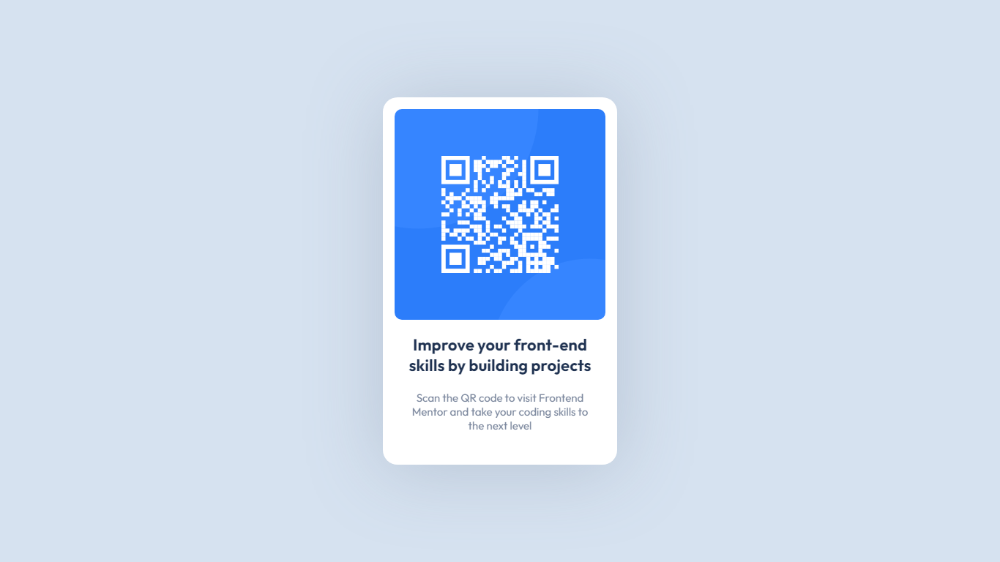

&nbsp;

# Frontend Mentor - QR code component solution

This is a solution to the [QR code component challenge on Frontend Mentor](https://www.frontendmentor.io/challenges/qr-code-component-iux_sIO_H). Frontend Mentor challenges help you improve your coding skills by building realistic projects.

[Screenshots](#screenshots) | [Links](#links) | [Built with](#built-with)

## Overview

### Screenshots

#### Desktop

#### Mobile

### Links

- Solution URL: [https://github.com/hellokallyne/qr-code-component.git](https://github.com/hellokallyne/qr-code-component.git)
- Live Site URL: [https://hellokallyne.github.io/qr-code-component](https://hellokallyne.github.io/qr-code-component)

## My process

### Built with

- HTML5 markup
- CSS custom properties
- Flexbox
- CSS Grid
- BEM Methodology

&nbsp;

Challenge by [Frontend Mentor](https://www.frontendmentor.io?ref=challenge). Coded by [Kallyne Layane](https://github.com/kllyncodes).
